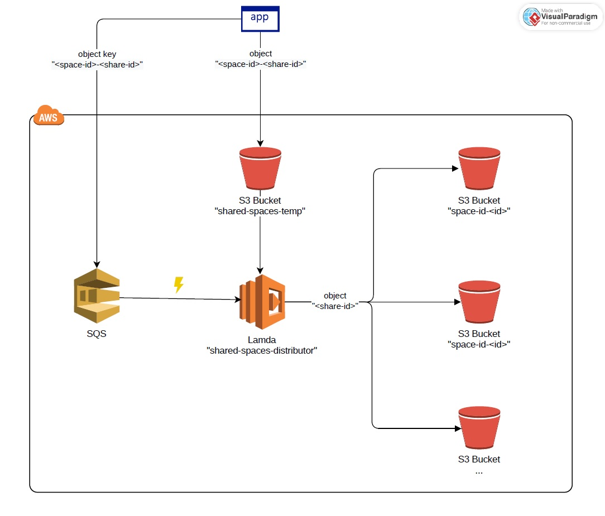
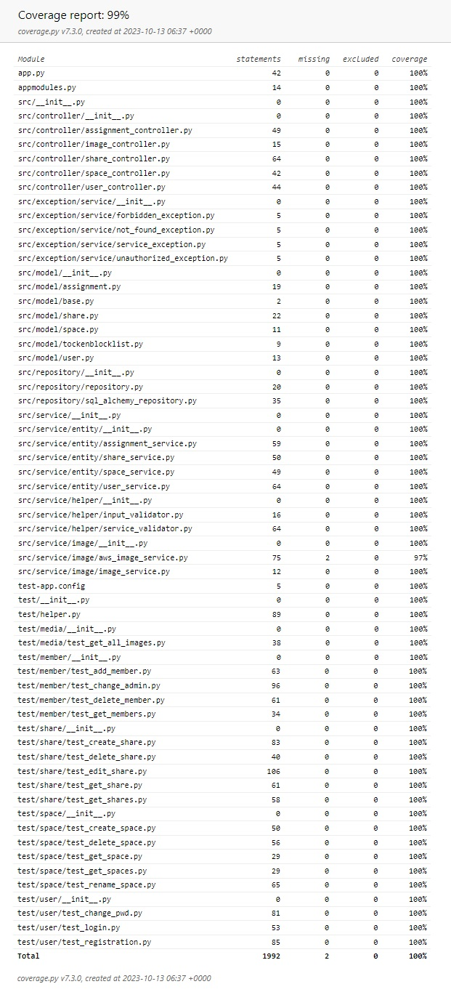

# Shared Spaces - backend
This is an enhanced version of the application to share thoughts between family members and friends.
 

## Table of Contents
* [General Info](#general-information)
* [Technologies Used](#technologies-used)
* [AWS](#aws)
* [Features](#features)
* [Tests](#tests)

## General Information
This project was developed to practice Python, Flask and AWS services. It is an enhanced version of the Family Advertisements App (see another project on my repository).
It utilizes the same idea to create a simple but fully functional solution of a REST application.
 
From user perspective it's a social media app, but for a small group of people, namely your family and friends. By definition, it provides an intimate space for your close ones to let them know that you throw a party or need help with your broken car. 
The app is deployed on an AWS EC2 Ubuntu instance and hosted by a Gunicorn server.  
Live demo: [Click here](http://ec2-54-146-229-245.compute-1.amazonaws.com/) 
Video demo: [YouTube](https://youtu.be/CBPJWvYRU5c)

## Technologies Used
- Python - version 3.10.8
- Flask - version 2.3.3
- SqlAlchemy - version 2.0.20
- AWS
    - Lambda
    - S3 Bucket
    - SQS (Simple Queue Service)

## AWS
The application stores photos in AWS S3 buckets. To achieve this, it utilizes a queue and Lambda function. Messages with the name of the new photo are sent to the queue. The new photo is also uploaded to a temporary S3 bucket. The queue triggers a Lambda function that, based on the photo's name from the SQS (Simple Queue Service), retrieves the photo from the temporary bucket and then adds the photo to a new or existing bucket corresponding to the space to which the photo belongs. This way, photos are organized according to their respective spaces.
  

## Features
A list of REST API endpoints exposed by the application
 
| Method  | Endpoint                                    | Description |
| ------- | ------------------------------------------- | ----------- |
| POST    | /login                                      | Log the user in. Accepts a JSON payload. |
| POST    | /register                                   | Register a new user. Accepts a JSON payload. |
| GET     | /logout                                     | Log the user out.	|
| PUT     | /change-password                            | Change user password. Accepts a JSON payload. |
| POST    | /spaces                                     | Create a new space. Accepts a JSON payload. |
| GET     | /spaces/<space_id>                          | Get details of a space by its ID. |
| DELETE  | /spaces/<space_id>                          | Delete a space by its ID. |
| PUT     | /spaces/<space_id>                          | Rename a space by its ID. Accepts a JSON payload. |
| GET     | /spaces                                     | Get a list of spaces for the logged-in user. |
| GET     | /spaces/<space_id>/members                  | Get a list of members in a space. |
| POST    | /spaces/<space_id>/members                  | Add a member to a space. Accept JSON payload. |
| DELETE  | /spaces/<space_id>/members/<user_id>        | Delete a member from a space. |
| PUT     | /spaces/<space_id>/members/<user_id>        | Change the admin permission for a member in a space. Accept JSON payload. |
| POST    | /spaces/<space_id>/shares                   | Create a new share in a space and optionally upload an image. Accepts a form. |
| GET     | /shares/<share_id>                          | Get details of a specific share by its share ID. |
| GET     | /spaces/<space_id>/shares                   | Get a list of shares within a space. |
| DELETE  | /shares/<share_id>                          | Delete a share by its share ID. |
| PUT     | /shares/<share_id>                          | Update a share's text and optionally upload a new image. Accepts a form. |
| GET     | /spaces/<space_id>/images                   | Get all image URLs within a space. |

## Tests
Full test coverage achieved with integration tests
  

