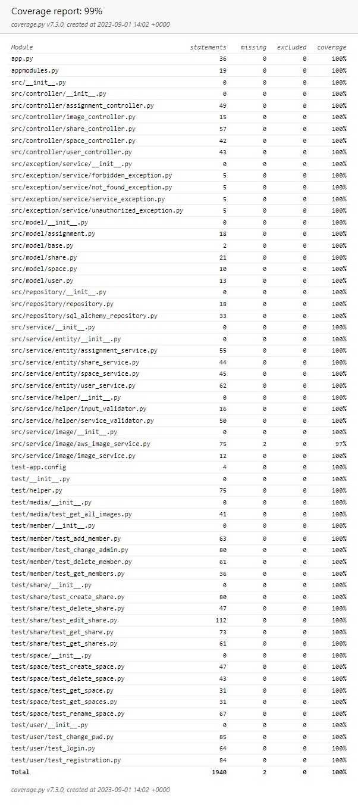

# Shared Spaces
Enhanced version of the application to share thoughts between family members and friends 
 

## Table of Contents
<!-- * [General Info](#general-information) -->
<!-- * [Technologies Used](#technologies-used) -->
* [AWS](#aws)
* [Tests](#tests)
<!-- * [Features](#features) -->
<!-- * [Project Status](#project-status) -->

## AWS
The application stores photos in AWS S3 buckets. To achieve this, it utilizes a queue and Lambda function. Messages with the name of the new photo are sent to the queue. The new photo is also uploaded to a temporary S3 bucket. The queue triggers a Lambda function that, based on the photo's name from the SQS (Simple Queue Service), retrieves the photo from the temporary bucket and then adds the photo to a new or existing bucket corresponding to the space to which the photo belongs. This way, photos are organized according to their respective spaces.
  

## Tests
Full test coverage achieved by over 140 integration tests
  
